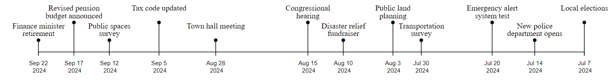
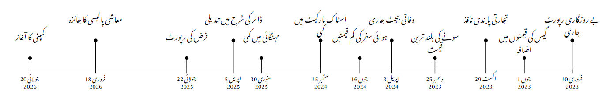
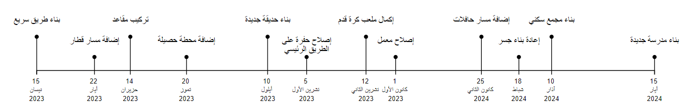

# Timeline Generation

## Abstract
Historically, timelines are written left to right, although alternative layouts have been studied. However, in these studies, people who speak right-to-left languages such as Arabic, Hebrew, and Urdu have been deliberately excluded to reduce variation across participants. To make science communication more inclusive, we need to account for these differences and explore whether alternative timeline layouts are more effective for these groups. In this study, we explore left-right, right-left, and top-bottom timeline orientations with English-Arabic and English-Urdu bilingual speakers.

Example timelines produced using code in this repository include: 

*A right-left English timeline illustrating fictitious government events.*

*A right-left Urdu timeline illustrating fictitious economic events.*

*A left-right Arabic timeline illustrating fictitious construction events.*

## Requirements
- D3.js
- Google Fonts
- [Live Server](https://marketplace.visualstudio.com/items?itemName=ritwickdey.LiveServer) (Visual Studio Code extension) 

### Running the Code
1. Clone/ fork this Git repository. 
2. View the repository in your preferred IDE (ex. Visual Studio Code). 
3. Follow instructions for the Liver Server extension to view the webpage locally. 

## Collaborators
- Yumna Ahmed [@yuahmed](https://github.com/yuahmed)
- Katy Williams [@kawilliams](https://github.com/kawilliams)

## License
